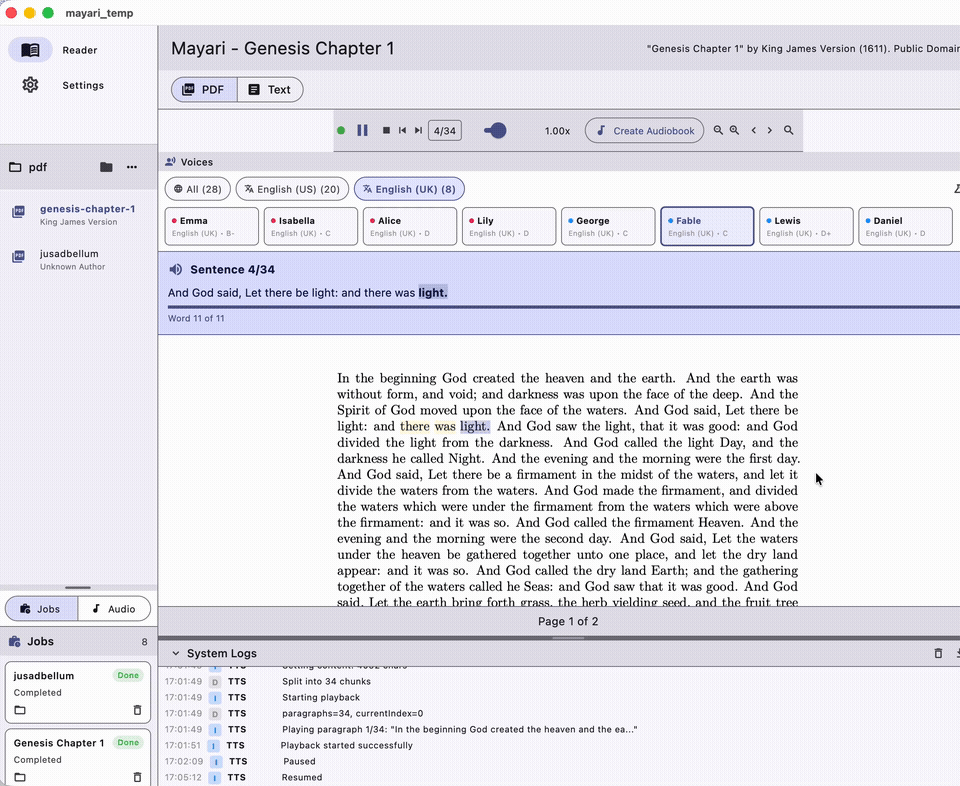

<div align="center">
  <h1>Mayari</h1>
  <p><i>Native document read-aloud and audiobook workspace for PDF, DOCX, and EPUB on macOS</i></p>
  <p>
    <a href="https://boltzmannentropy.github.io/mayari-web/"><strong>Website</strong></a>
    ·
    <a href="https://github.com/BoltzmannEntropy/Mayari"><strong>GitHub</strong></a>
  </p>
</div>

## Demo Video

[](assets/mayari-video.mp4)

Direct download: [`assets/mayari-video.mp4`](assets/mayari-video.mp4) · [`assets/mayari-video.mov`](assets/mayari-video.mov)

Mayari is a macOS app for reading PDF, DOCX, and EPUB files with native Kokoro text-to-speech, voice/language controls, and audiobook generation. It combines a document library, read-aloud tools, quote capture, and export workflows in one workspace.

## Highlights

- **100% Native** — No Python, no servers, no external dependencies
- **Native TTS** — KokoroSwift running on Apple MLX framework
- **Queue-Based Audiobooks** — Generate in background with persisted Jobs queue
- **Lightweight** — 46MB app (model downloads on first use)
- **Fast** — 3-5x faster than real-time audio generation
- **Offline** — Works without internet after initial model download

## Architecture

```
Flutter (Dart UI)
       ↓
MethodChannel
       ↓
KokoroTTSPlugin.swift
       ↓
KokoroSwift + Apple MLX
       ↓
Apple Silicon GPU
```

No HTTP servers. No API endpoints. Pure native communication via Flutter MethodChannels.

## Screenshot


## System Requirements

| Requirement | Details |
|-------------|---------|
| **macOS** | 15.0+ (Sequoia) |
| **iOS/iPadOS** | 18.0+ for App Store build baseline |
| **Processor** | Apple Silicon (M1/M2/M3/M4) for macOS build host |
| **RAM** | 8GB minimum |
| **Storage** | ~400MB (app + TTS model) |

## Features

| Feature | Description |
|---------|-------------|
| **PDF Workspace** | Three-pane layout: library sidebar, PDF/Text pane, quotes panel |
| **Quote Capture** | Select text → `Cmd+D` to save with page number |
| **Highlight Mode** | `Cmd+H` to auto-capture all selections |
| **Text-to-Speech** | 8 British voices, speed control, play/pause/stop |
| **Audiobook Jobs Queue** | Background queue with progress, retry/cancel, and saved outputs |
| **Export** | Markdown export with formatted citations |
| **Text Reader** | Edit/view markdown documents with TTS |

## Keyboard Shortcuts

| Shortcut | Action |
|----------|--------|
| `Cmd + D` | Add selected text as quote |
| `Cmd + H` | Toggle highlight mode |
| `Space` | Play/Pause TTS |
| `Escape` | Stop TTS |
| `Cmd + E` | Toggle edit/view in Text Reader |

## Installation

### From DMG (Recommended)

1. Download `Mayari-1.0.4.dmg` from [Releases](https://github.com/BoltzmannEntropy/Mayari/releases)
2. Open DMG and drag Mayari to Applications
3. Right-click → Open (first launch only, for Gatekeeper)
4. TTS model (~340MB) downloads automatically on first use

### From Source

```bash
# Prerequisites: Flutter 3.x, Xcode 16+, macOS 15.0+

git clone https://github.com/BoltzmannEntropy/Mayari.git
cd Mayari
flutter pub get
flutter run -d macos
```

## Text-to-Speech

Mayari uses **KokoroSwift**, a native Swift port of the Kokoro TTS model:

- **Engine**: KokoroSwift with Misaki G2P
- **Framework**: Apple MLX (Metal acceleration)
- **Sample Rate**: 24kHz
- **Performance**: ~320MB RAM, 1.7-2.4s for 7-8s audio

### Voices

| ID | Name | Gender | Grade |
|----|------|--------|-------|
| `bf_emma` | Emma | Female | B- (default) |
| `bf_isabella` | Isabella | Female | C |
| `bf_alice` | Alice | Female | D |
| `bf_lily` | Lily | Female | D |
| `bm_george` | George | Male | C |
| `bm_fable` | Fable | Male | C |
| `bm_lewis` | Lewis | Male | D+ |
| `bm_daniel` | Daniel | Male | D |

### Model Files

Downloaded on first TTS use:

| File | Size | Source |
|------|------|--------|
| `kokoro-v1_0.safetensors` | 327MB | HuggingFace mlx-community |
| `voices.npz` | 14MB | KokoroTestApp |

Location: `~/Library/Application Support/Mayari/kokoro-model/`

The exact active paths are shown in-app under `Settings → Text-to-Speech → Model location`.

## Audiobook Jobs Queue

- `Create Audiobook` adds a new background job immediately.
- Open the left deck `Jobs` tab to monitor queue progress and status.
- Jobs support retry/cancel/remove, and completed jobs appear in the `Audio` tab.
- Audiobook cards now have explicit `Play`, `Pause`, and `Stop` buttons.

## Export Format

Quotes export as markdown:

```markdown
# Collected Quotes

## "Book Title" by Author Name (2020).

> "Quote text"
>
> — p. 42
```

## Project Structure

```
lib/                 Flutter app (UI, state, services)
├── providers/       Riverpod state management
├── screens/         App screens
├── services/        TTS service (MethodChannel client)
└── widgets/         UI components

macos/Runner/
├── KokoroTTSPlugin.swift   Native TTS plugin
├── MainFlutterWindow.swift Plugin registration
└── project.pbxproj         SPM dependencies

scripts/
├── build-dmg.sh     DMG builder
├── release.sh       macOS release automation
├── check-ios-dist.sh iOS/iPad preflight validation
└── release-ios.sh   iOS/iPad IPA build + optional upload

ios/
├── Runner/                iOS app target
├── ExportOptions.plist    IPA export settings
└── Runner/PrivacyInfo.xcprivacy
```

## Native Plugin

`KokoroTTSPlugin.swift` implements:

| Method | Description |
|--------|-------------|
| `loadModel` | Load safetensors + voice embeddings |
| `speak` | Generate and play audio |
| `pause/resume/stop` | Playback control |
| `getVoices` | List available voices |
| `getModelStatus` | Check load state |

Communication via `MethodChannel("com.mayari.tts")`.

## Building

```bash
# Development
flutter run -d macos

# Release build
flutter build macos --release

# Create DMG
./scripts/build-dmg.sh
```

### iOS / iPad Build & Distribution Prep

```bash
# Validate iOS/iPad release prerequisites
bash ./scripts/check-ios-dist.sh

# Build IPA (TestFlight/App Store Connect ready artifact)
bash ./scripts/release-ios.sh
```

Optional upload with `asc` CLI:

```bash
export ASC_APP_ID="<app_store_connect_app_id>"
export ASC_TESTFLIGHT_GROUP="<testflight_group>"
bash ./scripts/release-ios.sh --upload --dist testflight
```

## Limitations

- Requires macOS 15.0+ and Apple Silicon
- Quote capture needs selectable PDF text (no OCR)
- British English voices only

## Star History

[](https://www.star-history.com/#BoltzmannEntropy/Mayari&Date)

## License

| Component | License |
|-----------|---------|
| Source Code | BSL-1.1 (`LICENSE`) |
| Binary Distribution | Mayari Binary License (`BINARY-LICENSE.txt`) |
| Overview | `LICENSE.md` |

Website: https://boltzmannentropy.github.io/mayari-web/
