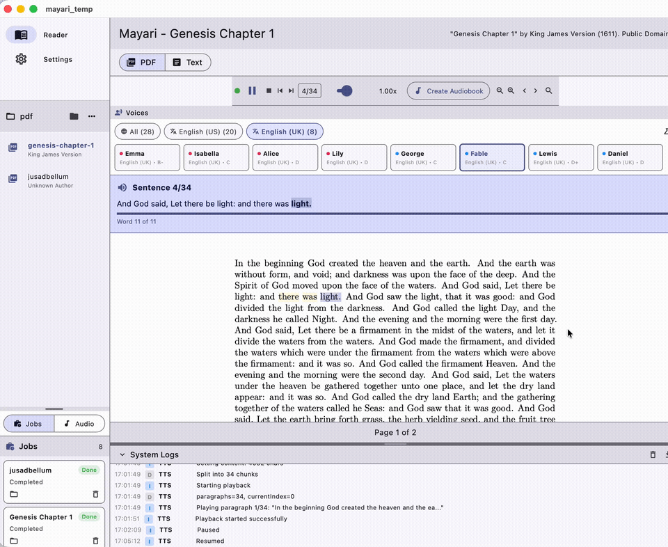
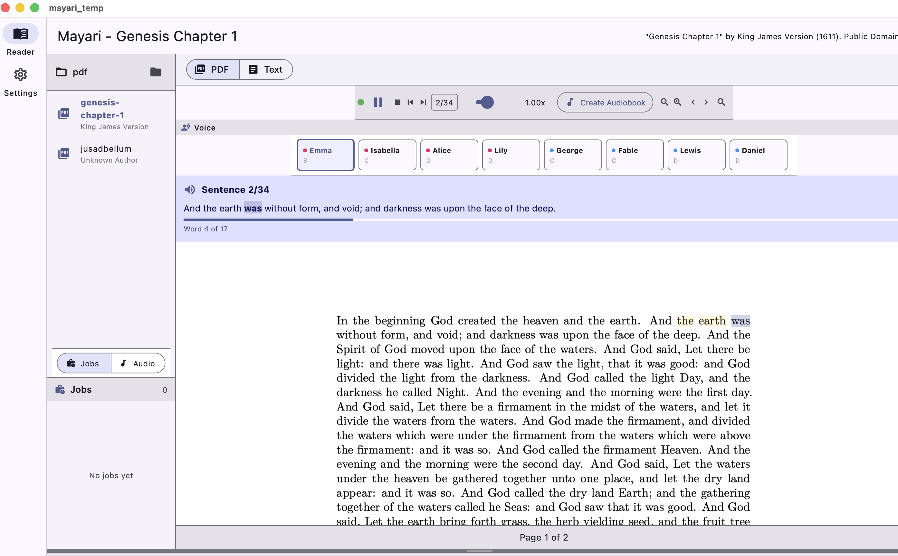

<div align="center">
  <h1>Mayari</h1>
  <p><i>Native document read-aloud and audiobook workspace for PDF, DOCX, and EPUB on macOS</i></p>
  <p>
    <a href="https://boltzmannentropy.github.io/mayari-web/"><strong>Website</strong></a>
    ·
    <a href="https://github.com/BoltzmannEntropy/Mayari"><strong>GitHub</strong></a>
  </p>
  <p>
    <a href="https://github.com/BoltzmannEntropy/Mayari/releases/download/v1.0.6/Mayari-1.0.6.dmg">
      
    </a>
  </p>
</div>

## Demo Video

[](assets/mayari-video.mp4)

Direct download: [`assets/mayari-video.mp4`](assets/mayari-video.mp4) · [`assets/mayari-video.mov`](assets/mayari-video.mov)

Mayari is a macOS app for reading PDF, DOCX, and EPUB files with native Kokoro text-to-speech, voice/language controls, and audiobook generation. It combines a document library, read-aloud tools, quote capture, and export workflows in one workspace.

## Highlights

- **100% Native** — No Python, no servers, no external dependencies
- **Native TTS** — KokoroSwift running on Apple MLX framework
- **Queue-Based Audiobooks** — Generate in background with persisted Jobs queue
- **Lightweight** — 46MB app (model downloads on first use)
- **Fast** — 3-5x faster than real-time audio generation
- **Offline** — Works without internet after initial model download

## Architecture

```
Flutter (Dart UI)
       ↓
MethodChannel
       ↓
KokoroTTSPlugin.swift
       ↓
KokoroSwift + Apple MLX
       ↓
Apple Silicon GPU
```

Core playback uses no app-internal HTTP server. The Flutter app communicates with native code through MethodChannels.

## Screenshot



## System Requirements

| Requirement | Details |
|-------------|---------|
| **macOS** | 15.0+ (Sequoia) |
| **iOS/iPadOS** | 18.0+ for App Store build baseline |
| **Processor** | Apple Silicon (M1/M2/M3/M4) for macOS build host |
| **RAM** | 8GB minimum |
| **Storage** | ~400MB (app + TTS model) |

## Features

| Feature | Description |
|---------|-------------|
| **PDF Workspace** | Three-pane layout: library sidebar, PDF/Text pane, quotes panel |
| **Quote Capture** | Select text → `Cmd+D` to save with page number |
| **Highlight Mode** | `Cmd+H` to auto-capture all selections |
| **Text-to-Speech** | 54 Kokoro voices across 9 language catalogs, speed control, play/pause/stop |
| **Audiobook Jobs Queue** | Background queue with progress, retry/cancel, and saved outputs |
| **Export** | Markdown export with formatted citations |
| **Text Reader** | Edit/view markdown documents with TTS |

## Keyboard Shortcuts

| Shortcut | Action |
|----------|--------|
| `Cmd + D` | Add selected text as quote |
| `Cmd + H` | Toggle highlight mode |
| `Space` | Play/Pause TTS |
| `Escape` | Stop TTS |
| `Cmd + E` | Toggle edit/view in Text Reader |

## Installation

### From DMG (Recommended)

1. Download [`Mayari-1.0.6.dmg`](https://github.com/BoltzmannEntropy/Mayari/releases/download/v1.0.6/Mayari-1.0.6.dmg)
2. Open DMG and drag Mayari to Applications
3. Right-click → Open (first launch only, for Gatekeeper)
4. TTS model (~340MB) downloads automatically on first use

### From Source

```bash
# Prerequisites: Flutter 3.x, Xcode 16+, macOS 15.0+

git clone https://github.com/BoltzmannEntropy/Mayari.git
cd Mayari
flutter pub get
flutter run -d macos
```

## Release Notices

### Alpha Release

This is an early alpha version intended for testing and development. Features may be incomplete, unstable, or change significantly before the stable release. Please report any issues on GitHub.

### ✎ Unsigned Build

As of February 26, 2026, the distributed DMG is unsigned/not notarized by Apple.

1. Open the DMG and drag `Mayari.app` to `Applications`.
2. Remove the quarantine attribute by running one of these commands in Terminal:
   ```bash
   # If installed to /Applications (system-wide):
   xattr -d com.apple.quarantine /Applications/Mayari.app

   # If installed to ~/Applications (user-only):
   xattr -d com.apple.quarantine ~/Applications/Mayari.app
   ```
3. In `Applications`, right-click `Mayari.app` and choose `Open`.
4. Click `Open` in the warning dialog.
5. If launch is still blocked, go to `System Settings -> Privacy & Security`.
6. Click `Open Anyway` for Mayari and confirm with password/Touch ID.

## Text-to-Speech

Mayari uses **KokoroSwift**, a native Swift port of the Kokoro TTS model:

- **Engine**: KokoroSwift with Misaki G2P
- **Framework**: Apple MLX (Metal acceleration)
- **Sample Rate**: 24kHz
- **Performance**: ~320MB RAM, 1.7-2.4s for 7-8s audio

### Voices (Complete Catalog)

Mayari currently exposes **54 voices** across **9 language catalogs**:

| Language | Count | Voice IDs |
|----------|-------|-----------|
| English (US) | 20 | `af_alloy`, `af_aoede`, `af_bella`, `af_heart`, `af_jessica`, `af_kore`, `af_nicole`, `af_nova`, `af_river`, `af_sarah`, `af_sky`, `am_adam`, `am_echo`, `am_eric`, `am_fenrir`, `am_liam`, `am_michael`, `am_onyx`, `am_puck`, `am_santa` |
| English (UK) | 8 | `bf_alice`, `bf_emma` (default), `bf_isabella`, `bf_lily`, `bm_daniel`, `bm_fable`, `bm_george`, `bm_lewis` |
| Spanish | 3 | `ef_dora`, `em_alex`, `em_santa` |
| French | 1 | `ff_siwis` |
| Hindi | 4 | `hf_alpha`, `hf_beta`, `hm_omega`, `hm_psi` |
| Italian | 2 | `if_sara`, `im_nicola` |
| Japanese | 5 | `jf_alpha`, `jf_gongitsune`, `jf_nezumi`, `jf_tebukuro`, `jm_kumo` |
| Brazilian Portuguese | 3 | `pf_dora`, `pm_alex`, `pm_santa` |
| Mandarin Chinese | 8 | `zf_xiaobei`, `zf_xiaoni`, `zf_xiaoxiao`, `zf_xiaoyi`, `zm_yunjian`, `zm_yunxi`, `zm_yunxia`, `zm_yunyang` |

Canonical runtime definitions:
- `lib/services/tts_service.dart` (`defaultVoices`)
- `macos/Runner/KokoroTTSPlugin.swift` (`kokoroVoices`)

### Model Files

Downloaded on first TTS use:

| File | Size | Source |
|------|------|--------|
| `kokoro-v1_0.safetensors` | 327MB | HuggingFace mlx-community |
| `voices.npz` | 14MB | KokoroTestApp |

Location: `~/Library/Application Support/Mayari/kokoro-model/`

The exact active paths are shown in-app under `Settings → Text-to-Speech → Model location`.

## Audiobook Jobs Queue

- `Create Audiobook` adds a new background job immediately.
- Open the left deck `Jobs` tab to monitor queue progress and status.
- Jobs support retry/cancel/remove, and completed jobs appear in the `Audio` tab.
- Audiobook cards now have explicit `Play`, `Pause`, and `Stop` buttons.

## Long-Form Audiobook Test (Public Domain)

Mayari includes a bundled long public-domain history excerpt:

- `assets/examples/texts/public_domain_history_wells_excerpt.txt`
- Source: Project Gutenberg #35461, *A Short History of the World* by H. G. Wells

Generate long-form test audiobooks through the native TTS API (MethodChannel) with British voices:

```bash
./scripts/generate-long-history-audiobooks.sh
```

Optional configuration:

```bash
MAYARI_LONG_TEST_VOICES="bf_emma,bm_george,bm_lewis" \
MAYARI_LONG_TEST_MAX_CHARS=120000 \
MAYARI_LONG_TEST_SPEED=1.0 \
./scripts/generate-long-history-audiobooks.sh
```

Outputs are written to:

- `~/Documents/Mayari Audiobooks/long-history-tests/`

Then open the generated `.wav` files directly in Finder/QuickTime to listen.

## Bundled Audio Samples

All demo samples are bundled in `assets/examples/audiobooks/`.

### British Voice Samples

- `sample-emma.mp3`
- `sample-isabella.mp3`
- `sample-alice.mp3`
- `sample-lily.mp3`
- `sample-george.mp3`
- `sample-fable.mp3`
- `sample-lewis.mp3`
- `sample-daniel.mp3`

### Multilingual Samples

- `sample-spanish-dora.mp3`
- `sample-french-siwis.mp3`
- `sample-hindi-alpha.mp3`
- `sample-italian-sara.mp3`
- `sample-japanese-nezumi.mp3`
- `sample-portuguese-dora.mp3`
- `sample-mandarin-xiaobei.mp3`

### Example Audiobooks

- `example_pdf_genesis.wav`
- `example_docx_readaloud.wav`
- `example_epub_readaloud.wav`
- `long_history_bf_emma_20260221173325268396.wav`
- `long_history_bm_george_20260221173325268396.wav`
- `long_history_manifest_20260221173325268396.json`
- `long-history-emma.mp3`
- `long-history-george.mp3`

## Export Format

Quotes export as markdown:

```markdown
# Collected Quotes

## "Book Title" by Author Name (2020).

> "Quote text"
>
> — p. 42
```

## Project Structure

```
lib/                 Flutter app (UI, state, services)
├── providers/       Riverpod state management
├── screens/         App screens
├── services/        TTS service (MethodChannel client)
└── widgets/         UI components

macos/Runner/
├── KokoroTTSPlugin.swift   Native TTS plugin
├── MainFlutterWindow.swift Plugin registration
└── project.pbxproj         SPM dependencies

scripts/
├── build-dmg.sh     DMG builder
├── generate-long-history-audiobooks.sh Long-text British voice test runner
├── release.sh       macOS release automation
├── check-ios-dist.sh iOS/iPad preflight validation
└── release-ios.sh   iOS/iPad IPA build + optional upload

ios/
├── Runner/                iOS app target
├── ExportOptions.plist    IPA export settings
└── Runner/PrivacyInfo.xcprivacy

bin/
├── mayarictl              App + MCP control script
└── mayari_mcp_server.py   MCP JSON-RPC/HTTP bridge
```

## Native Plugin

`KokoroTTSPlugin.swift` implements:

| Method | Description |
|--------|-------------|
| `loadModel` | Load safetensors + voice embeddings |
| `speak` | Generate and play audio |
| `pause/resume/stop` | Playback control |
| `getVoices` | List available voices |
| `getModelStatus` | Check load state |

Communication via `MethodChannel("com.mayari.tts")`.

## MCP Integration (Optional Companion Server)

Mayari includes an optional MCP bridge for Claude/agent integrations:

- Script: `bin/mayari_mcp_server.py`
- Protocol: JSON-RPC 2.0 over HTTP (`initialize`, `tools/list`, `tools/call`)
- Default bind: `127.0.0.1:8086`
- Logs: `runs/logs/mayari_mcp_server.log`

Run:

```bash
python3 bin/mayari_mcp_server.py --host 127.0.0.1 --port 8086
```

Environment:

- `MAYARI_MCP_HOST`
- `MAYARI_MCP_PORT`
- `MAYARI_BACKEND_URL` (optional health-probe target)

## Building

```bash
# Development
flutter run -d macos

# Release build
flutter build macos --release

# Create DMG
./scripts/build-dmg.sh
```

### iOS / iPad Build & Distribution Prep

```bash
# Validate iOS/iPad release prerequisites
bash ./scripts/check-ios-dist.sh

# Build IPA (TestFlight/App Store Connect ready artifact)
bash ./scripts/release-ios.sh
```

Optional upload with `asc` CLI:

```bash
export ASC_APP_ID="<app_store_connect_app_id>"
export ASC_TESTFLIGHT_GROUP="<testflight_group>"
bash ./scripts/release-ios.sh --upload --dist testflight
```

## Limitations

- Requires macOS 15.0+ and Apple Silicon
- Quote capture needs selectable PDF text (no OCR)
- Non-English voices are listed in catalog, but synthesis language routing is currently optimized for English in the native runtime

## Star History

[](https://www.star-history.com/#BoltzmannEntropy/Mayari&Date)

## License

| Component | License |
|-----------|---------|
| Source Code | BSL-1.1 (`LICENSE`) |
| Binary Distribution | Mayari Binary License (`BINARY-LICENSE.txt`) |
| Overview | `LICENSE.md` |

Website: https://boltzmannentropy.github.io/mayari-web/
